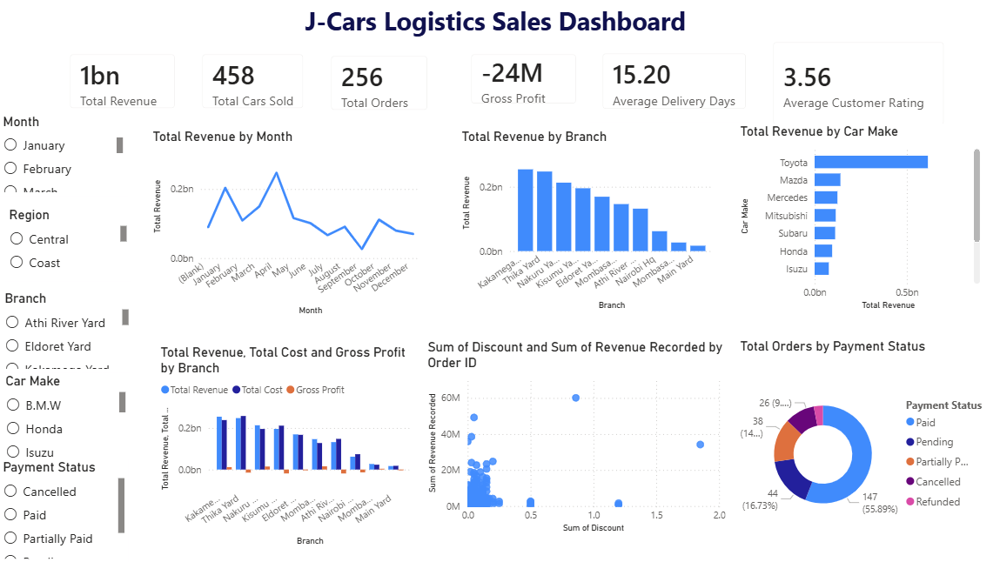

Dashboard Preview

  

##Project Overview

The JCars Logistics Sales & Performance Dashboard is an end-to-end Business Intelligence project that analyzes vehicle sales, revenue performance, customer behavior, and logistics efficiency across different regions in Kenya.

The dashboard supports data-driven decision-making by providing insights into:

Sales performance by car make, model, and branch
Revenue and profitability trends
Customer segmentation and behavior
Delivery and logistics efficiency
Payment and order fulfillment performance
## Project Objective

To transform raw logistics and sales data into an interactive Power BI dashboard that enables:

Executive-level performance tracking
Identification of top-performing products and regions
Customer and sales representative analysis
Operational efficiency evaluation (delivery & logistics)
## Data Pipeline & Architecture
1. Raw Data Preparation
Dataset provided as a flat file (CSV/Excel)
Initial inspection and profiling performed
2. Data Ingestion (DBeaver → Aiven PostgreSQL)
Created a PostgreSQL database in Aiven Cloud
Connected using DBeaver
Created a structured table for JCars Logistics dataset
Imported raw data using DBeaver’s import tool
Validated data using SQL queries
3. Power BI Data Connection
Connected Power BI to Aiven PostgreSQL database
Used Get Data → PostgreSQL Database
Entered server credentials (host, database, port, username, password)
Loaded dataset using Import Mode
4. Data Cleaning & Transformation (Power BI – Power Query)

All data cleaning and transformation was performed in Power BI Power Query Editor, including:

Standardizing inconsistent Order Date and Delivery Date formats
Converting Excel serial numbers into valid dates
Handling missing and invalid values (N/A, #DATE!, nulls)
Normalizing categorical fields (Region, Branch, Payment Status, etc.)
Converting Discount column into percentage format
Cleaning inconsistent text values (trim, case standardization)
Creating calculated fields such as Delivery Days
# DAX Measures & Calculations
## Sales Metrics
Total Revenue
Total Cars Sold
Total Orders
Revenue per Customer
Revenue per Unit
## Profitability Metrics
Total Cost
Gross Profit
Gross Profit Margin
Revenue After Discount
Total Discount Amount
## Logistics Metrics
Average Delivery Days
Total Logistics Cost
## Customer Metrics
Average Customer Rating
Total Customers
Return Rate
## Payment Metrics
Paid Revenue
Pending Revenue
Cancelled Orders
## Dashboard Features & Visuals
KPI Cards (Executive Summary)
Total Revenue
Total Cars Sold
Total Orders
Gross Profit
Average Delivery Days
Average Customer Rating
## Trend Analysis
Monthly Revenue Trend (Line Chart)
## Regional Analysis
Revenue by Region/County (Map Visual)
Branch Performance Comparison
## Sales Performance
Revenue by Car Make (Bar Chart)
Units Sold by Vehicle Type
Top 10 Customers Table
## Financial Analysis
Revenue vs Cost vs Profit (Clustered Column Chart)
Discount vs Revenue Relationship (Scatter Plot)
## Operational Analysis
Payment Status Breakdown (Donut Chart)
Delivery Status Analysis
Logistics Cost vs Revenue
## Key Insights
Toyota and Mitsubishi were the highest revenue-generating car brands.
SUV vehicle types recorded the highest unit sales.
Nairobi and surrounding regions were the top-performing markets.
Cash remained the dominant payment method.
Some branches showed high logistics costs relative to revenue.
Data quality issues were detected (e.g., extreme discounts up to 120%).
Delivery performance varied significantly across regions and branches.
## Recommendations
Increase stock for high-demand vehicle types (SUVs and Toyota models).
Optimize logistics operations in high-cost branches.
Strengthen credit control to reduce pending payments.
Standardize discount policies to avoid extreme or inconsistent values.
Improve delivery efficiency in underperforming regions.
Implement stronger data validation at entry stage.

## Tools & Technologies
Power BI Desktop (Data Modeling & Visualization)
Power Query (Data Cleaning & Transformation)
PostgreSQL (Aiven Cloud Database)
DBeaver (Data Ingestion Tool)
DAX (Calculated Measures & KPIs)